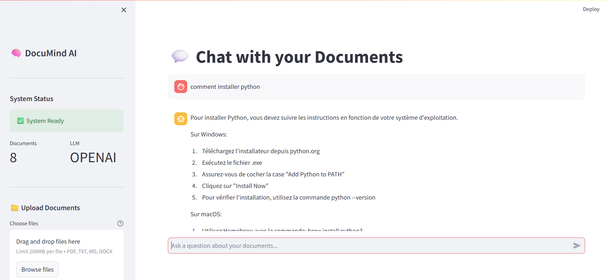
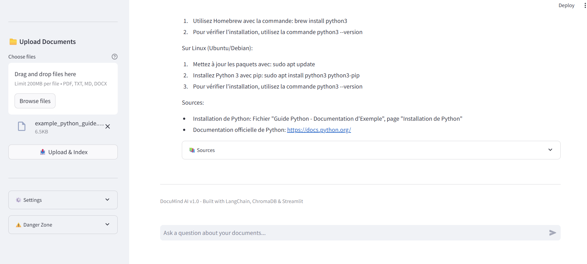

# 🧠 DocuMind AI - Smart Documentation Assistant

A production-ready **Retrieval Augmented Generation (RAG)** system built with LangChain, ChromaDB, and modern AI technologies. DocuMind AI enables intelligent question-answering over your documents with source citations.


## 📸 Screenshots

<div align="center">
  
  
</div>

## ✨ Features

- 📚 **Multi-format Support**: PDF, TXT, Markdown, DOCX
- 🔍 **Semantic Search**: Advanced vector similarity search with ChromaDB
- 🤖 **Flexible LLM Backend**: OpenAI GPT or local Ollama models
- 💬 **Interactive Chat**: Streamlit-based conversational interface
- 🚀 **REST API**: FastAPI endpoints for easy integration
- 📊 **Source Citations**: Every answer includes document sources
- 🎯 **Production Ready**: Proper error handling, logging, and configuration

## 🏗️ Architecture

```
User Question
     ↓
[Document Processing] → Text Chunking (1000 chars, 200 overlap)
     ↓
[Vector Store] → Embeddings (ChromaDB)
     ↓
[Retrieval] → Top-K Similar Chunks
     ↓
[LLM Generation] → Answer with Context
     ↓
Response + Sources
```

## 📦 Tech Stack

| Component | Technology |
|-----------|-----------|
| **Framework** | LangChain 0.1.0 |
| **Vector DB** | ChromaDB 0.4.22 |
| **LLM** | OpenAI GPT-3.5/4 or Ollama |
| **API** | FastAPI 0.108.0 |
| **UI** | Streamlit 1.29.0 |
| **Embeddings** | OpenAI text-embedding-ada-002 |
| **Processing** | PyPDF, python-docx, markdown |

## 🚀 Quick Start

### Prerequisites

- Python 3.10 or higher
- OpenAI API key (or Ollama for local models)
- 4GB+ RAM recommended

### Installation

```bash
# Clone the repository
git clone https://github.com/A2ELAOUDI/DocuMind-AI.git
cd DocuMind-AI

# Create virtual environment
python -m venv venv

# Activate virtual environment
# Windows:
venv\Scripts\activate
# macOS/Linux:
source venv/bin/activate

# Install dependencies
pip install -r requirements.txt

# Configure environment
cp .env.example .env
# Edit .env and add your OpenAI API key
```

### Configuration

Edit `.env` file:

```env
# OpenAI Configuration
OPENAI_API_KEY=your_api_key_here
LLM_PROVIDER=openai  # or 'ollama' for local

# Vector Database
CHROMA_PERSIST_DIRECTORY=./data/vectordb

# RAG Settings
CHUNK_SIZE=1000
CHUNK_OVERLAP=200
TEMPERATURE=0.7
MAX_TOKENS=500
```

## 🎮 Usage

### Option 1: Streamlit UI (Recommended)

```bash
streamlit run ui/streamlit_app.py
```

Then open http://localhost:8501 in your browser.

**Steps:**
1. Click "Initialize System"
2. Upload documents (PDF, TXT, MD, DOCX)
3. Start asking questions!

### Option 2: FastAPI Backend

```bash
# Start the API server
uvicorn api.main:app --reload
```

API will be available at http://localhost:8000

**Swagger Documentation**: http://localhost:8000/docs

**Example API Calls:**

```bash
# Upload documents
curl -X POST "http://localhost:8000/upload" \
  -F "files=@document.pdf"

# Ask a question
curl -X POST "http://localhost:8000/query" \
  -H "Content-Type: application/json" \
  -d '{"question": "What is RAG?", "k": 4}'

# Get statistics
curl http://localhost:8000/stats
```

### Option 3: Python SDK

```python
from src.vector_store import VectorStore
from src.rag_engine import RAGEngine
from src.document_processor import DocumentProcessor

# Initialize components
vector_store = VectorStore()
rag_engine = RAGEngine(vector_store)

# Add documents
rag_engine.add_documents_to_knowledge_base(["doc1.pdf", "doc2.md"])

# Ask questions
response = rag_engine.query("What is machine learning?")
print(response["answer"])
print(response["sources"])
```

## 📁 Project Structure

```
DocuMind-AI/
├── src/
│   ├── document_processor.py  # Document loading & chunking
│   ├── vector_store.py        # ChromaDB vector database
│   ├── rag_engine.py          # RAG orchestration
│   └── utils.py               # Utility functions
├── api/
│   └── main.py                # FastAPI application
├── ui/
│   └── streamlit_app.py       # Streamlit interface
├── data/
│   ├── documents/             # Input documents
│   └── vectordb/              # Vector database storage
├── tests/
│   └── test_rag.py            # Unit tests
├── requirements.txt           # Python dependencies
├── .env.example               # Environment variables template
└── README.md                  # This file
```

## 🧪 Testing

```bash
# Run tests
pytest tests/

# Run with coverage
pytest --cov=src tests/
```

## 🔧 Advanced Configuration

### Using Ollama (Free, Local LLM)

```bash
# Install Ollama
# https://ollama.ai

# Pull a model
ollama pull llama2

# Update .env
LLM_PROVIDER=ollama
OLLAMA_MODEL=llama2
```

### Customizing Chunk Size

Smaller chunks = more precise retrieval, but less context
Larger chunks = more context, but less precise

```env
CHUNK_SIZE=500    # Smaller chunks
CHUNK_OVERLAP=100
```

### Using Different Embedding Models

```python
# In vector_store.py
embeddings = OpenAIEmbeddings(model="text-embedding-3-small")
```

## 📊 Performance

- **Indexing Speed**: ~1000 chunks/minute
- **Query Latency**: <2s (with OpenAI)
- **Memory Usage**: ~100MB + vector DB size
- **Supported Docs**: Unlimited (limited by disk space)

## 🛡️ Security Best Practices

- ✅ Never commit `.env` file
- ✅ Use environment variables for API keys
- ✅ Sanitize file names before processing
- ✅ Validate file types before upload
- ✅ Use HTTPS in production
- ✅ Implement rate limiting for API

## 🤝 Contributing

Contributions are welcome! Please:

1. Fork the repository
2. Create a feature branch (`git checkout -b feature/amazing-feature`)
3. Commit your changes (`git commit -m 'Add amazing feature'`)
4. Push to the branch (`git push origin feature/amazing-feature`)
5. Open a Pull Request

## 📝 License

This project is licensed under the MIT License - see the [LICENSE](LICENSE) file for details.

## 🙏 Acknowledgments

- [LangChain](https://www.langchain.com/) - RAG framework
- [ChromaDB](https://www.trychroma.com/) - Vector database
- [OpenAI](https://openai.com/) - LLM & Embeddings
- [Streamlit](https://streamlit.io/) - UI framework
- [FastAPI](https://fastapi.tiangolo.com/) - API framework

## 📧 Contact

For questions or suggestions, please open an issue or contact [abdouelaoudi8@outlook.fr]

## 🗺️ Roadmap

- [ ] Multi-language support
- [ ] Advanced filtering options
- [ ] Conversation memory
- [ ] Export chat history
- [ ] Docker deployment
- [ ] Kubernetes configs
- [ ] GraphQL API
- [ ] Web scraping integration

---

**Built with ❤️ using LangChain, ChromaDB & Streamlit**
